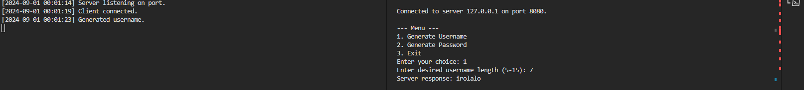
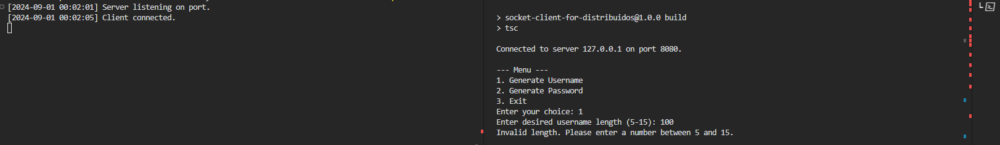
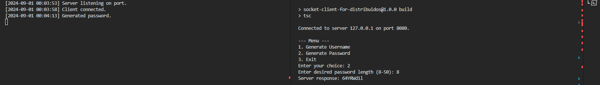
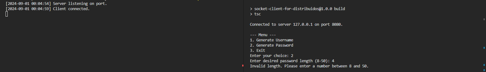

# Sockets Task

### Comand for compile c

requeried -> mingw and windows

- gcc {nameFile}.c -o {nameOutput}.exe -lws2_32

## Init for Testing

#### Server in c

```shell
cd {projectRoot}
cd server/output
./server.exe
```

#### Client in c

```shell
cd {projectRoot}
cd client/c/output
./client.exe
```

#### Client in node(my version node -> v20.8.1)

```shell
cd {projectRoot}
cd client/c/node
npm install
npm start
```

## Test

### GeneratorUserNames

Test Cases(server in c and client in node)

- Given a connection to the client and the generation of userNames is selected when the user enters a valid length(menor a 5 ni mayor a 15) then a username should be returned(alternating between vowels and consonants).



- Given a connection to the client and username generation is selected, when the user enters an invalid length, an error code should be returned.



---

---

---

### GeneratorPassword

Test Cases

- Given a connection to the client and the generation of password is selected when the user enters a valid length(igual 8 y menor a 50) then a username should be returned(alphanumeric string, including upper and lower case).



- Given a connection to the client and password generation is selected, when the user enters an invalid length, an error code should be returned.


