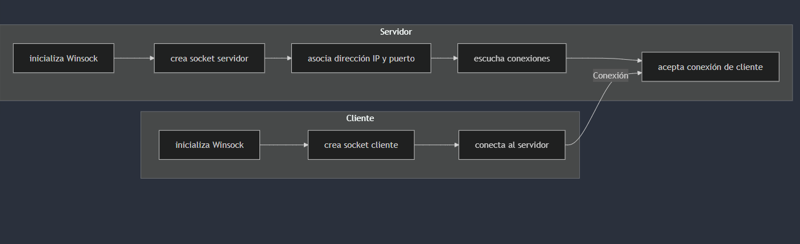
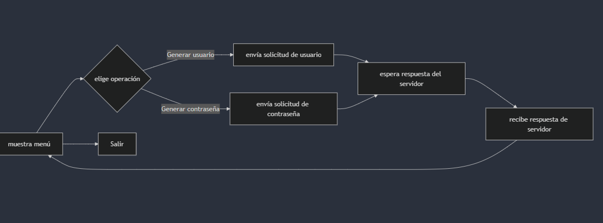
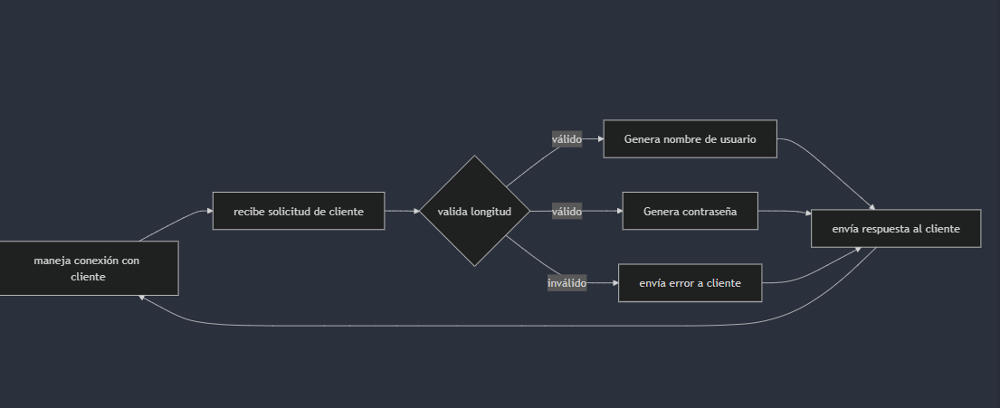

# Sockets Task

### Author -> Pablo Vieyra

---

#### Comand for compile c

requeried -> mingw and windows

- gcc {nameFile}.c -o {nameOutput}.exe -lws2_32

# Init for Testing

### Server in c

```shell
cd {projectRoot}
cd server/output
./server.exe
```

### Client in c

```shell
cd {projectRoot}
cd client/c/output
./client.exe
```

### Client in node(my version node -> v20.8.1)

```shell
cd {projectRoot}
cd client/c/node
npm install
npm start
```

# Test

### GeneratorUserNames

Test Cases(server in c and client in node)

- Given a connection to the client and the generation of userNames is selected when the user enters a valid length(menor a 5 ni mayor a 15) then a username should be returned(alternating between vowels and consonants).


- Given a connection to the client and username generation is selected, when the user enters an invalid length, an error code should be returned.


---

---

---

### GeneratorPassword

Test Cases

- Given a connection to the client and the generation of password is selected when the user enters a valid length(igual 8 y menor a 50) then a username should be returned(alphanumeric string, including upper and lower case).


- Given a connection to the client and password generation is selected, when the user enters an invalid length, an error code should be returned.


# Strategy

Para el desarrollo de esta app, primero me enfoqué en construir el servidor, donde se concentra toda la lógica de negocio. Así, los clientes, tanto en C como en Node.js, quedaron más ligeros, centrados solo en la visualización y la interacción con el usuario. Mientras avanzaba, añadí logs tanto en el servidor como en los clientes para monitorear cómo interactuaban entre sí y también implementé códigos de error para identificar problemas específicos.

Una vez que terminé el desarrollo en C, aproveché mis conocimientos en Node.js para crear un cliente con un enfoque en clean code. La idea era mantener el código modular y fácil de entender, siguiendo buenas prácticas como SOLID

# Explicacion del codigo

### Librerías Usadas

- **`<stdio.h>`**: Proporciona funciones para realizar operaciones de entrada y salida, como `printf` y `scanf`.
- **`<stdlib.h>`**: Contiene funciones para la gestión de memoria dinámica, control de procesos, conversiones y otras operaciones generales, como `malloc`, `free`, `exit`.
- **`<string.h>`**: Incluye funciones para manejar cadenas de caracteres, como `strcmp`, `strlen`, `strcpy`.
- **`<winsock2.h>`**: Proporciona las definiciones para trabajar con sockets en Windows. Incluye funciones para la inicialización y limpieza de sockets, envío y recepción de datos, etc.
- **`<time.h>`**: Ofrece funciones para manejar y manipular fechas y horas, como `time`, `localtime`.
- **`<ctype.h>`**: Contiene funciones para la clasificación de caracteres, como `isdigit`, `isalpha`.

### Servidor

1. **`initialize_winsock()`**
   - Inicializa la librería Winsock, que es necesaria para el manejo de sockets en Windows. Si falla, registra un mensaje de error y termina el programa.
2. **`create_server_socket()`**
   - Crea un socket de servidor utilizando el protocolo TCP (SOCK_STREAM). Si falla, muestra un mensaje de error y termina el programa.
3. **`bind_and_listen(SOCKET server_socket)`**
   - Asocia el socket a una dirección IP y un puerto (`SERVER_PORT`). Luego, el socket comienza a escuchar conexiones entrantes con un máximo de 3 conexiones pendientes (`MAX_PENDING_CONNECTIONS`). Si falla alguna de estas operaciones, se registra un error y se cierra el socket.
4. **`handle_client_connection(SOCKET client_socket)`**
   - Maneja la comunicación con un cliente conectado. Recibe datos del cliente, procesa la solicitud (generar nombre de usuario o contraseña), valida la longitud de la solicitud, genera la cadena correspondiente y la envía de vuelta al cliente.
5. **`generate_username(int length)`**
   - Genera un nombre de usuario alternando entre vocales y consonantes. La longitud debe estar entre 5 y 15 caracteres.
6. **`generate_password(int length)`**
   - Genera una contraseña alfanumérica con la longitud especificada. Debe estar entre 8 y 50 caracteres.
7. **`send_response(SOCKET client_socket, const char *response)`**
   - Envía una respuesta al cliente. Si falla, registra un error.
8. **`log_message(const char *message, int error_code)`**
   - Registra un mensaje con la fecha y hora actuales. Dependiendo del `error_code`, muestra un mensaje de error específico o solo el mensaje.
9. **`cleanup(SOCKET server_socket)`**
   - Cierra el socket y limpia la librería Winsock.
10. **`validate_length(int length, int min, int max, const char *error_message, SOCKET client_socket)`**
    - Valida que la longitud esté dentro de un rango específico. Si no es así, envía un mensaje de error al cliente y registra el error.
11. **`main()`**
    - Inicializa Winsock, crea el socket del servidor, lo asocia a una dirección y comienza a escuchar conexiones entrantes. Acepta conexiones y maneja la comunicación con los clientes.

### Client en Node

El cliente Node.js está dividido en varias clases, cada una siguiendo principios de buenas prácticas de programación como SOLID, para mantener el código modular y fácil de mantener.

- **UserInterface**: Maneja la interacción con el usuario.
- **BusinessLogic**: Valida las entradas del usuario.
- **SocketsInterface**: Gestiona la comunicación con el servidor.

### Flujo de la Aplicación

1. **Conexión al Servidor**
   - La aplicación inicia conectándose al servidor con la IP y el puerto especificados.
   - Si la conexión es exitosa, se muestra un menú al usuario.
2. **Mostrar Menú**
   - El menú ofrece tres opciones: generar un username, generar una contraseña o salir de la aplicación.
   - Dependiendo de la elección del usuario, se llama a una de las funciones correspondientes.
3. **Solicitud de Username o Contraseña**
   - Según la opción seleccionada, la aplicación pide al usuario que ingrese la longitud deseada para el username o la contraseña.
   - La longitud se valida utilizando la lógica de negocio.
   - Si la longitud es válida, se envía una solicitud al servidor.
4. **Respuesta del Servidor**
   - El servidor procesa la solicitud y envía una respuesta, que se muestra al usuario.
   - Después de recibir la respuesta, el menú se muestra nuevamente para que el usuario pueda realizar otra acción.
5. **Salir de la Aplicación**
   - Si el usuario elige salir, la conexión con el servidor se cierra y la aplicación termina.

### `index.ts`

Este archivo es el punto de entrada de la aplicación. Aquí se configuran las instancias de `UserInterface`, `BusinessLogic`, y `SocketsInterface`, y se maneja el flujo principal de la aplicación.

- **Conexión inicial**: Se conecta al servidor y, si es exitosa, llama a `showMenu`.
- **Menú y manejo de opciones**: El menú se muestra usando `userInterface.showMenu`, y según la elección del usuario, se llaman funciones específicas (`handleUsernameRequest`, `handlePasswordRequest`).
- **Manejo de solicitudes**: Cuando se genera una solicitud, se valida la longitud usando `businessLogic.validateLength` y luego se envía la solicitud al servidor mediante `networkClient.sendRequest`.
- **Recepción de respuestas**: Las respuestas del servidor se manejan asíncronamente y se muestran al usuario antes de retornar al menú.

### Client en C

1. **`initialize_winsock()`**
   - Inicializa Winsock para el cliente.
2. **`create_client_socket()`**
   - Crea un socket para el cliente utilizando TCP. Si falla, registra un error y termina.
3. **`connect_to_server(SOCKET client_socket)`**
   - Conecta el cliente al servidor en la dirección `127.0.0.1` y el puerto `8080`. Si falla, registra un error y termina.
4. **`show_menu(SOCKET client_socket)`**
   - Muestra un menú al usuario para elegir entre generar un nombre de usuario o una contraseña. Según la elección del usuario, envía la solicitud al servidor y espera una respuesta.
5. **`send_request(SOCKET client_socket, const char *request)`**
   - Envía una solicitud al servidor. Si falla, registra un error.
6. **`receive_response(SOCKET client_socket)`**
   - Recibe la respuesta del servidor y la muestra al usuario. Si falla, registra un error.
7. **`cleanup(SOCKET client_socket)`**
   - Cierra el socket del cliente y limpia Winsock.
8. **`main()`**
   - Inicializa Winsock, crea el socket del cliente, se conecta al servidor y muestra el menú para interactuar con el servidor.

---

### Diagrams

#### Inicialización y Conexión



---

#### Interacción del Cliente



---

#### Procesamiento en el Servidor



## Documentation

https://nodejs.org/api/net.html

https://dev.to/flaviocopes/node-accept-input-from-the-command-line-1h6

https://learn.microsoft.com/en-us/windows/win32/winsock/complete-server-code#winsock-server-source-code
